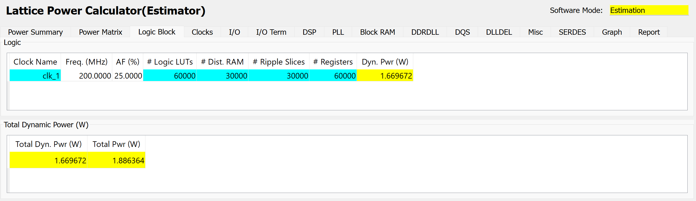
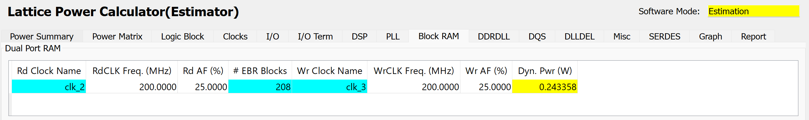
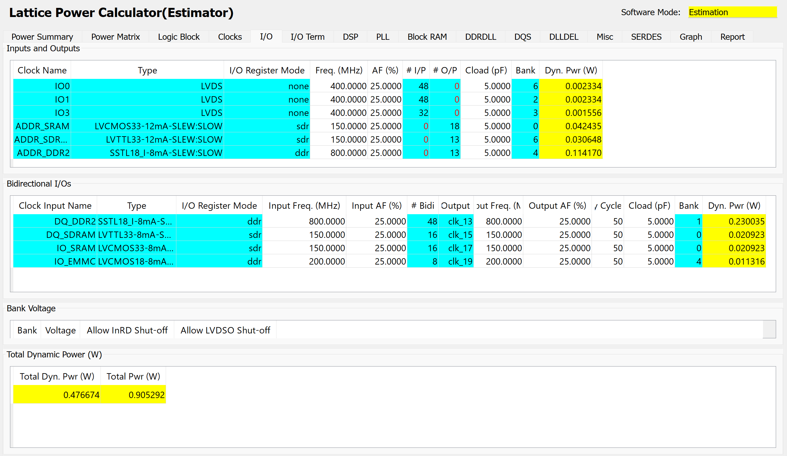
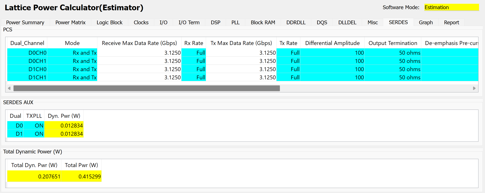
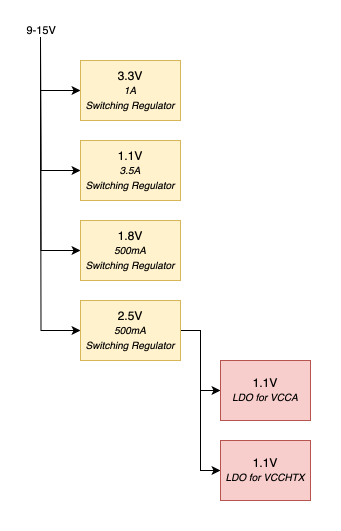

Design
======

Pinout
------

The following table outlines the FPGA interface signals and their pinout constraints.

.. note:: The I/O column is from the FPGA's perspective to ease the creation of design constraints files.

.. csv-table:: Oscillator interface signals
   :header-rows: 1
   :width: 100%
   :file: ../assets/osc-pinout.csv
   :delim: ;

.. csv-table:: Flash interface signals
   :header-rows: 1
   :width: 100%
   :file: ../assets/flash-pinout.csv
   :delim: ;

.. csv-table:: eMMC interface signals
   :header-rows: 1
   :width: 100%
   :file: ../assets/emmc-pinout.csv
   :delim: ;

.. csv-table:: SRAM interface signals
   :header-rows: 1
   :width: 100%
   :file: ../assets/sram-pinout.csv
   :delim: ;

.. csv-table:: SDRAM interface signals
   :header-rows: 1
   :width: 100%
   :file: ../assets/sdram-pinout.csv
   :delim: ;

.. csv-table:: DDR2 interface signals
   :header-rows: 1
   :width: 100%
   :file: ../assets/ddr2-pinout.csv
   :delim: ;

.. csv-table:: IO connector interface signals
   :header-rows: 1
   :width: 100%
   :file: ../assets/io-pinout.csv
   :delim: ;

Power
-----

FPGA Power Estimation
^^^^^^^^^^^^^^^^^^^^^

In order to perform a rough FPGA power estimation, the following assumptions were taken :

- 200MHz internal frequency
- 25% Activity Factor (as stated in :ref:`AN1 <reftable>`)
- 70% logic utilization
- 100% BRAM utilization
- 4 RX/TX SerDes channels at 3.125Gbps with TXPLL enabled
- 64 LVDS input differential pairs
- eMMC IOs
- SRAM Address/Data IOs
- SDRAM Address/DQ IOs
- DDR2 Address/DQ IOs

.. note:: I/O utilization isn't precisely modelled as the IO power consumption is low. Margins will be taken to prevent any supply issues.

|

|

|

|

.. image:: ../assets/power-summary.png
   :width: 100%
   :align: center

|

Point-Of-Load Supply
^^^^^^^^^^^^^^^^^^^^

The following table outlines the voltage requirements of the specified components :

.. flat-table:: Component Supply Voltage Requirements
   :header-rows: 1
   :width: 100%

   * - Component
     - Name
     - Voltage
     - Max Current
     - Description
   
   * - :rspan:`7` LFE5UM-85F-*BG756C
     - VCC
     - 1.1V ±5%
     - 3A
     - Core Supply Voltage
   * - VCCA
     - 1.1V ±5%
     - 300mA
     - Analog Supply Voltage
   * - VCCAUX
     - 2.5V ±5%
     - 200mA
     - Auxilary Supply Voltage
   * - VCCIO[*]
     - 
     - 
     - 
   * - VCCIO8
     - 3.3V ±10%
     - 100mA
     - sysIO bank Supply Voltage
   * - VCCHRX
     - 1.1V ±5%
     - 50mA
     - SerDes RX Termination
   * - VCCHTX
     - 1.1V ±5%
     - 10mA
     - SerDes TX Termination
   * - VCCAUXA
     - 2.5V ±5%
     - 20mA
     - SerDes Auxilary Supply Voltage
   * - IS61W25616BLL
     - VDD
     - 3.3V ±5%
     - 50mA
     - Supply Voltage
   * - :rspan:`1` IS42S32800J
     - VDD
     - 3.3V ±10%
     - 190mA
     - Supply Voltage
   * - VDDQ
     - 3.3V ±10%
     - *included in VDD*
     - I/O Supply Voltage
   * - :rspan:`2` IS43DR16320E
     - VDD
     - 1.8V ±5%
     - 185mA
     - Supply Voltage
   * - VDDQ
     - 1.8V ±5%
     - *included in VDD*
     - I/O Supply Voltage
   * - VDDL
     - 1.8V ±5%
     - *included in VDD*
     - DLL Supply Voltage
   * - W25Q158JVPIM
     - VCC
     - 3.3V ±10%
     - 25mA
     - Supply Voltage
   * - :rspan:`1` KLMAG1JETD-B041
     - VDD
     - 1.8V ±8%
     - 180mA
     - Controller Supply Voltage
   * - VDDF
     - 3.3V ±10%
     - 50mA
     - Memory Supply Voltage

The following table outlines the supply voltage requirement per voltage :

.. flat-table:: Supply Voltage Requirements
   :header-rows: 1
   :width: 100%

   * - Voltage
     - Current capacity

   * - 1.1V ±5%
     - 3.5A
   * - 2.5V ±5%
     - 500mA
   * - 3.3V ±5%
     - 1A
   * - 1.8V ±5%
     - 500mA

The following diagram outlines the Point-Of-Load architecture of the board :

.. note:: The 9-15V input shall support up to 10W of power.
