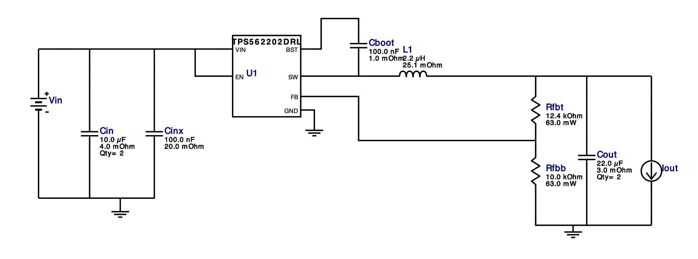

Design
======

Power
-----

FPGA Power Estimation
^^^^^^^^^^^^^^^^^^^^^

In order to perform a rough FPGA power estimation, the following assumptions were taken :

- LFE5U-85F-8BG756C reference
- 200MHz internal frequency
- 25% Activity Factor (as stated in :ref:`AN1 <reftable>`)
- 70% logic utilization
- 100% BRAM utilization
- 64 LVDS input differential pairs
- eMMC IOs
- SRAM Address/Data IOs
- SDRAM Address/DQ IOs
- DDR2 Address/DQ IOs

.. note:: I/O utilization isn't precisely modelled as the IO power consumption is low. Margins will be taken to prevent any supply issues.

.. image:: ../assets/power-summary.png
   :width: 100%
   :align: center

|

Part Selection
^^^^^^^^^^^^^^

The following table outlines the voltage requirements of the specified components :

.. flat-table:: Component Supply Voltage Requirements
   :header-rows: 1
   :width: 100%

   * - Component
     - Name
     - Voltage
     - Max Current
     - Description
   
   * - :rspan:`3` LFE5U-85F-*BG756C
     - VCC
     - 1.1V ±5%
     - 3A
     - Core Supply Voltage
   * - VCCAUX
     - 2.5V ±5%
     - 200mA
     - Auxilary Supply Voltage
   * - VCCIO[*]
     - 
     - 
     - 
   * - VCCIO8
     - 3.3V ±10%
     - 100mA
     - sysIO bank Supply Voltage
   * - IS61W25616BLL
     - VDD
     - 3.3V ±5%
     - 50mA
     - Supply Voltage
   * - :rspan:`1` IS42S16160J
     - VDD
     - 3.3V ±10%
     - 140mA
     - Supply Voltage
   * - VDDQ
     - 3.3V ±10%
     - *included in VDD*
     - I/O Supply Voltage
   * - :rspan:`2` IS43DR16320E
     - VDD
     - 1.8V ±5%
     - 185mA
     - Supply Voltage
   * - VDDQ
     - 1.8V ±5%
     - *included in VDD*
     - I/O Supply Voltage
   * - VDDL
     - 1.8V ±5%
     - *included in VDD*
     - DLL Supply Voltage
   * - W25Q158JVPIM
     - VCC
     - 3.3V ±10%
     - 25mA
     - Supply Voltage
   * - :rspan:`1` THGBMJG6C1LBAIL
     - VDD
     - 1.8V ±8%
     - 220mA
     - Controller Supply Voltage
   * - VDDF
     - 3.3V ±10%
     - 140mA
     - Memory Supply Voltage

The following table outlines the supply voltage requirement per voltage :

.. flat-table:: Supply Voltage Requirements
   :header-rows: 1
   :width: 100%

   * - Voltage
     - Current capacity

   * - 1.1V ±5%
     - 3.5A
   * - 2.5V ±5%
     - 500mA
   * - 3.3V ±5%
     - 1A
   * - 1.8V ±5%
     - 500mA

Component Selection
^^^^^^^^^^^^^^^^^^^

1.1V Core
`````````

.. flat-table:: Characteristics Requirements
   :stub-columns: 1
   :width: 100%

   * - IC
     - ST1S41PHR
   * - Topology
     - Buck
   * - Input Voltage
     - 9-15V
   * - Output Voltage
     - 1.1V (2% ripple) - 4A max


.. flat-table:: Component Selection
   :header-rows: 1
   :width: 100%
  
   * - Type
     - Ref
     - Value
     - Description

   * - IC
     - 
     - ST1S41PHR
     - ST1S41PHR - Power SO 8 - STMicroelectronics
   
   * - Capacitor
     - Cin
     - 10uF
     - 25 V - 10% - muRata - GRM31CR61E106KA12L

   * - Capacitor
     - Cout
     - 47uF
     - 6.3 V - 20% - AVX - 12106D476MAT2A

   * - Inductor
     - L
     - 2.2uH
     - 10.1 A - Panasonic - ETQP3M2R2KVP

   * - Resistor
     - Rh
     - 8.2kOhms
     - 1% tolerance

   * - Resistor
     - Rl
     - 22kOhms
     - 1% tolerance

   * - Capacitor
     - Cin_A
     - 1uF
     - 

.. flat-table:: Simulation Results
   :header-rows: 1
   :stub-columns: 1
   :width: 100%

   * - 
     - Value
     - Constraint
  
   * - Vout
     - 1.1V
     - ±1% 
   * - Ripple
     - 11mv - 0.96%
     - <2%
   * - IL ripple
     - 702mA - 17.54% of 4A
     - <1.2A
   * - Fws
     - 850kHz
     - 
   * - Ton
     - 115.47ns
     - >= 90ns
   * - Vin ripple
     - 1.01%
     - 
   * - Bandwidth
     - 118.98kHz
     - < 141.68kHz
   * - Phase Margin
     - 60.96°
     - >= 45°
   * - IC Tj
     - 113.7°C
     - < 125°C
   * - ΔTj
     - 88.7°C
     - 

.. image:: ../assets/buck-1V1-eff.png
   :width: 90%
   :align: center

.. note:: The converter's efficiency is rather low at the operating limit of 15Vin - 4A but is acceptable in most behaviors. Proper power dissipation shall be put in place to handle the 2.5W of dissipated power at the operating limit.

2.5V
````

.. flat-table:: Characteristics Requirements
   :stub-columns: 1
   :width: 100%

   * - IC
     - L6981NDR
   * - Topology
     - Buck
   * - Input Voltage
     - 9-15V
   * - Output Voltage
     - 2.5V (2% ripple) - 1A max


.. flat-table:: Component Selection
   :header-rows: 1
   :width: 100%
  
   * - Type
     - Ref
     - Value
     - Description

   * - IC
     - 
     - L6981NDR
     - L6981NDR - SO 8 - STMicroelectronics
   
   * - Capacitor
     - Cin
     - 10uF
     - 25 V - 10% - muRata - GRM31CR61E106KA12L

   * - Capacitor
     - Cout
     - 100uF
     - 6.3 V - 20% - muRata - GRM32ER60J107ME20L

   * - Inductor
     - L
     - 22uH
     - 8.8 A - Panasonic - ETQP5M220YFC

   * - Resistor
     - Rh
     - 160kOhms
     - 1% tolerance

   * - Resistor
     - Rl
     - 82.5kOhms
     - 1% tolerance

   * - Capacitor
     - Cvcc
     - 1uF
     - 

   * - Capacitor
     - Cru
     - 30pF
     - 

   * - Capacitor
     - Cboot
     - 100nF
     - 

   * - Capacitor
     - CinA
     - 1uF
     - 

.. flat-table:: Simulation Results
   :header-rows: 1
   :stub-columns: 1
   :width: 100%

   * - 
     - Value
     - Constraint
  
   * - Vout
     - 2.5V
     - ±1% 
   * - Ripple
     - 2mv - 0.07%
     - <2%
   * - IL ripple
     - 246mA - 24.61% of 1A
     - <300mA
   * - Fws
     - 400kHz
     - 
   * - Ton
     - 440.13ns
     - >= 85ns
   * - Vin ripple
     - 0.69%
     - 
   * - Bandwidth
     - 34.6kHz
     - 
   * - Phase Margin
     - 63.47°
     - >= 45°
   * - IC Tj
     - 40.6°C
     - < 150°C
   * - ΔTj
     - 15.6°C
     - 

.. image:: ../assets/buck-2V5-eff.png
   :width: 90%
   :align: center

3.3V
````

.. flat-table:: Characteristics Requirements
   :stub-columns: 1
   :width: 100%

   * - IC
     - L6981NDR
   * - Topology
     - Buck
   * - Input Voltage
     - 9-15V
   * - Output Voltage
     - 3.3V (2% ripple) - 1A max

.. image:: ../assets/buck-3V3.png
   :width: 90%
   :align: center

.. flat-table:: Component Selection
   :header-rows: 1
   :width: 100%
  
   * - Type
     - Ref
     - Value
     - Description

   * - IC
     - 
     - L6981NDR
     - L6981NDR - SO 8 - STMicroelectronics
   
   * - Capacitor
     - Cin
     - 10uF
     - 25 V - 10% - muRata - GRM31CR61E106KA12L

   * - Capacitor
     - Cout
     - 47uF
     - 6.3 V - 20% - AVX - 12106D476MAT2A

   * - Inductor
     - L
     - 27uH
     - 3.8 A - Würth Elektronik - 744770127

   * - Resistor
     - Rh
     - 237kOhms
     - 1% tolerance

   * - Resistor
     - Rl
     - 82kOhms
     - 1% tolerance

   * - Capacitor
     - Cvcc
     - 1uF
     - 

   * - Capacitor
     - Cru
     - 18pF
     - 

   * - Capacitor
     - Cboot
     - 100nF
     - 

   * - Capacitor
     - CinA
     - 1uF
     - 

.. flat-table:: Simulation Results
   :header-rows: 1
   :stub-columns: 1
   :width: 100%

   * - 
     - Value
     - Constraint
  
   * - Vout
     - 3.31V
     - ±1% 
   * - Ripple
     - 5mv - 0.15%
     - <2%
   * - IL ripple
     - 244mA - 24.45% of 1A
     - <300mA
   * - Fws
     - 400kHz
     - 
   * - Ton
     - 573.80ns
     - >= 85ns
   * - Vin ripple
     - 0.83%
     - 
   * - Bandwidth
     - 47.31kHz
     - 
   * - Phase Margin
     - 54.84°
     - >= 45°
   * - IC Tj
     - 40.9°C
     - < 150°C
   * - ΔTj
     - 15.9°C
     - 


1.8V
````

.. flat-table:: Characteristics Requirements
   :stub-columns: 1
   :width: 100%

   * - IC
     - L6981NDR
   * - Topology
     - Buck
   * - Input Voltage
     - 9-15V
   * - Output Voltage
     - 1.8V (2% ripple) - 1A max



.. flat-table:: Component Selection
   :header-rows: 1
   :width: 100%
  
   * - Type
     - Ref
     - Value
     - Description

   * - IC
     - 
     - L6981NDR
     - L6981NDR - SO 8 - STMicroelectronics
   
   * - Capacitor
     - Cin
     - 10uF
     - 25 V - 10% - muRata - GRM31CR61E106KA12L

   * - Capacitor
     - Cout
     - 100uF
     - 6.3 V - 20% - muRata - GRM32ER60J107ME20L

   * - Inductor
     - L
     - 22uH
     - 8.8 A - Panasonic - ETQP5M220YFC

   * - Resistor
     - Rh
     - 91kOhms
     - 1% tolerance

   * - Resistor
     - Rl
     - 82kOhms
     - 1% tolerance

   * - Capacitor
     - Cvcc
     - 1uF
     - 

   * - Capacitor
     - Cru
     - 62pF
     - 

   * - Capacitor
     - Cboot
     - 100nF
     - 

   * - Capacitor
     - CinA
     - 1uF
     - 

.. flat-table:: Simulation Results
   :header-rows: 1
   :stub-columns: 1
   :width: 100%

   * - 
     - Value
     - Constraint
  
   * - Vout
     - 1.79V
     - ±1% 
   * - Ripple
     - 2mv - 0.09%
     - <2%
   * - IL ripple
     - 190mA - 19.04% of 1A
     - <300mA
   * - Fws
     - 400kHz
     - 
   * - Ton
     - 322.05ns
     - >= 85ns
   * - Vin ripple
     - 0.55%
     - 
   * - Bandwidth
     - 36.23kHz
     - 
   * - Phase Margin
     - 53.66°
     - >= 45°
   * - IC Tj
     - 40.4°C
     - < 150°C
   * - ΔTj
     - 15.4°C
     - 


Power Sequencing
^^^^^^^^^^^^^^^^

Timing requirements
```````````````````

.. flat-table:: Power-up timings
   :header-rows: 1
   :stub-columns: 2
   :width: 100%

   * - IC
     - Voltage
     - Max ramp rate
     - Max start time
   * - ST1S41PHR
     - 1.1V
     - 1.1mV/us
     - 1ms
   * - L6981NDR
     - 1.8V
     - 1.8mV/us
     - 1.6ms
   * - L6981NDR
     - 2.5V
     - 2.5mV/us
     - 1.6ms
   * - L6981NDR
     - 3.3V
     - 3.3mV/us
     - 1.6ms

Sequence
````````

The power supply sequencing is performed with at least a 2ms delay.

.. flat-table:: Power sequencer IC
   :stub-columns: 1
   :width: 100%

   * - IC
     - LM3880
   * - Sequence Number
     - 1 (1-2-3 / 3-2-1)
   * - Timing Designator
     - AA (10ms)
   * - Ordering reference
     - LM3880MF*-1AA

The power sequencing IC is powered by the generated 3.3V as shown in the following diagram :

.. image:: ../assets/power-sequencing.svg
   :width: 70%
   :align: center

|

The following formula is used to compute the value of :math:`C_{\text{en}}` which applies a delay to the start of the sequence:

.. math::

   t_{\text{enable_delay}} = \frac{1.25V * C_{\text{en}}}{7 \mu A}

:math:`t_{\text{enable_delay}}` must greater than the start time of the 3.3V regulation (ie. 1.6ms), therefore :

.. math::

  C_{\text{en}} = 56nF \implies t_{\text{enable_delay}} = 10ms

Configuration
-------------

The sysCONFIG pins are configured with CFGMDN[2:0] = 010 (ie. MSPI). 4.7k pull-up or -down resistors are used.

Pull-up resistors are placed on the SPI bus.

FPGA Pinout
------

The following table outlines the FPGA interface signals and their pinout constraints.

.. note:: The I/O column is from the FPGA's perspective to ease the creation of design constraints files.

.. csv-table:: Oscillator interface signals
   :header-rows: 1
   :width: 100%
   :file: ../assets/osc-pinout.csv
   :delim: ;

.. csv-table:: Flash interface signals
   :header-rows: 1
   :width: 100%
   :file: ../assets/flash-pinout.csv
   :delim: ;

.. csv-table:: eMMC interface signals
   :header-rows: 1
   :width: 100%
   :file: ../assets/emmc-pinout.csv
   :delim: ;

.. csv-table:: SRAM interface signals
   :header-rows: 1
   :width: 100%
   :file: ../assets/sram-pinout.csv
   :delim: ;

.. csv-table:: SDRAM interface signals
   :header-rows: 1
   :width: 100%
   :file: ../assets/sdram-pinout.csv
   :delim: ;

.. csv-table:: DDR2 interface signals
   :header-rows: 1
   :width: 100%
   :file: ../assets/ddr2-pinout.csv
   :delim: ;

.. csv-table:: IO connector interface signals
   :header-rows: 1
   :width: 100%
   :file: ../assets/io-pinout.csv
   :delim: ;
