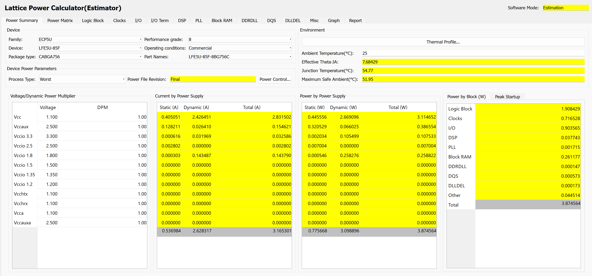
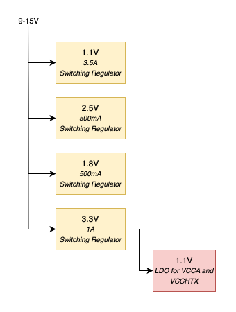
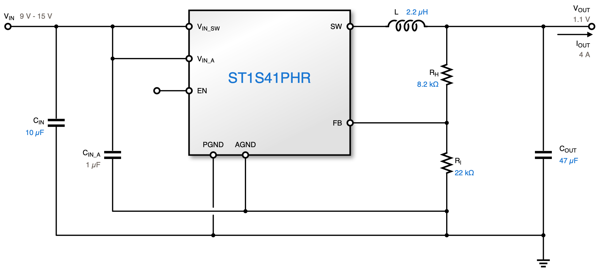
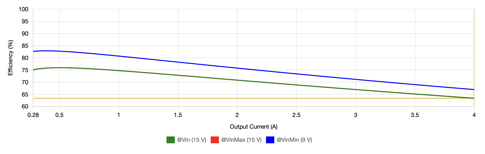
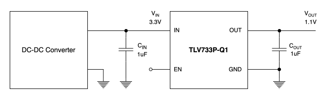
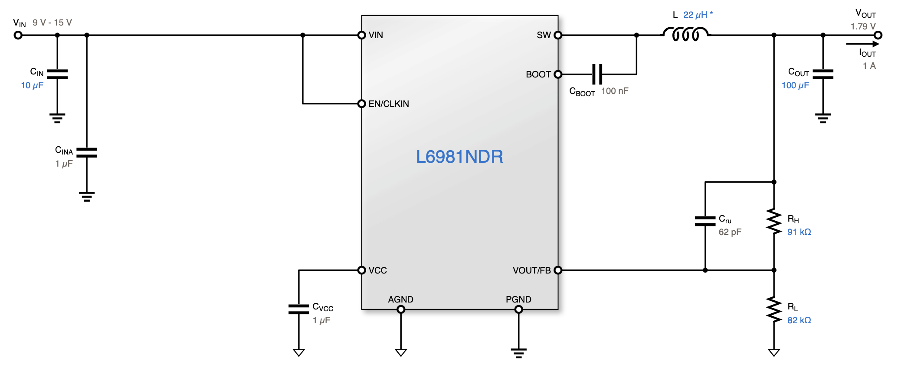

Design
======

Pinout
------

The following table outlines the FPGA interface signals and their pinout constraints.

.. note:: The I/O column is from the FPGA's perspective to ease the creation of design constraints files.

.. csv-table:: Oscillator interface signals
   :header-rows: 1
   :width: 100%
   :file: ../assets/osc-pinout.csv
   :delim: ;

.. csv-table:: Flash interface signals
   :header-rows: 1
   :width: 100%
   :file: ../assets/flash-pinout.csv
   :delim: ;

.. csv-table:: eMMC interface signals
   :header-rows: 1
   :width: 100%
   :file: ../assets/emmc-pinout.csv
   :delim: ;

.. csv-table:: SRAM interface signals
   :header-rows: 1
   :width: 100%
   :file: ../assets/sram-pinout.csv
   :delim: ;

.. csv-table:: SDRAM interface signals
   :header-rows: 1
   :width: 100%
   :file: ../assets/sdram-pinout.csv
   :delim: ;

.. csv-table:: DDR2 interface signals
   :header-rows: 1
   :width: 100%
   :file: ../assets/ddr2-pinout.csv
   :delim: ;

.. csv-table:: IO connector interface signals
   :header-rows: 1
   :width: 100%
   :file: ../assets/io-pinout.csv
   :delim: ;

Power
-----

FPGA Power Estimation
^^^^^^^^^^^^^^^^^^^^^

In order to perform a rough FPGA power estimation, the following assumptions were taken :

- 200MHz internal frequency
- 25% Activity Factor (as stated in :ref:`AN1 <reftable>`)
- 70% logic utilization
- 100% BRAM utilization
- 4 RX/TX SerDes channels at 3.125Gbps with TXPLL enabled
- 64 LVDS input differential pairs
- eMMC IOs
- SRAM Address/Data IOs
- SDRAM Address/DQ IOs
- DDR2 Address/DQ IOs

.. note:: I/O utilization isn't precisely modelled as the IO power consumption is low. Margins will be taken to prevent any supply issues.

.. image:: ../assets/power-logic.png
   :width: 100%
   :align: center

|


|


|


|



|

Part Selection
^^^^^^^^^^^^^^

The following table outlines the voltage requirements of the specified components :

.. flat-table:: Component Supply Voltage Requirements
   :header-rows: 1
   :width: 100%

   * - Component
     - Name
     - Voltage
     - Max Current
     - Description
   
   * - :rspan:`7` LFE5UM-85F-*BG756C
     - VCC
     - 1.1V ±5%
     - 3A
     - Core Supply Voltage
   * - VCCA
     - 1.1V ±5%
     - 300mA
     - Analog Supply Voltage
   * - VCCAUX
     - 2.5V ±5%
     - 200mA
     - Auxilary Supply Voltage
   * - VCCIO[*]
     - 
     - 
     - 
   * - VCCIO8
     - 3.3V ±10%
     - 100mA
     - sysIO bank Supply Voltage
   * - VCCHRX
     - 1.1V ±5%
     - 50mA
     - SerDes RX Termination
   * - VCCHTX
     - 1.1V ±5%
     - 10mA
     - SerDes TX Termination
   * - VCCAUXA
     - 2.5V ±5%
     - 20mA
     - SerDes Auxilary Supply Voltage
   * - IS61W25616BLL
     - VDD
     - 3.3V ±5%
     - 50mA
     - Supply Voltage
   * - :rspan:`1` IS42S32800J
     - VDD
     - 3.3V ±10%
     - 190mA
     - Supply Voltage
   * - VDDQ
     - 3.3V ±10%
     - *included in VDD*
     - I/O Supply Voltage
   * - :rspan:`2` IS43DR16320E
     - VDD
     - 1.8V ±5%
     - 185mA
     - Supply Voltage
   * - VDDQ
     - 1.8V ±5%
     - *included in VDD*
     - I/O Supply Voltage
   * - VDDL
     - 1.8V ±5%
     - *included in VDD*
     - DLL Supply Voltage
   * - W25Q158JVPIM
     - VCC
     - 3.3V ±10%
     - 25mA
     - Supply Voltage
   * - :rspan:`1` KLMAG1JETD-B041
     - VDD
     - 1.8V ±8%
     - 180mA
     - Controller Supply Voltage
   * - VDDF
     - 3.3V ±10%
     - 50mA
     - Memory Supply Voltage

The following table outlines the supply voltage requirement per voltage :

.. flat-table:: Supply Voltage Requirements
   :header-rows: 1
   :width: 100%

   * - Voltage
     - Current capacity

   * - 1.1V ±5%
     - 3.5A
   * - 2.5V ±5%
     - 500mA
   * - 3.3V ±5%
     - 1A
   * - 1.8V ±5%
     - 500mA

The following diagram outlines the Point-Of-Load architecture of the board :



.. note:: The 9-15V input shall support up to 10W of power.

.. flat-table:: DC-DC converters
   :header-rows: 1
   :width: 100%

   * - Component
     - Vin
     - Vout
     - Current capacity
  
   * - ST1S41PUR
     - 4-18V
     - 0.8-18V
     - 4A
   * - L6981NDR
     - 3.5-38V
     - 0.85V-38V
     - 1.5A
   * - TLV73311PQDRVRQ1
     - 1.4-5.5V
     - 1.1V
     - 300mA

Component Selection
^^^^^^^^^^^^^^^^^^^

1.1V Core
`````````

.. flat-table:: Characteristics Requirements
   :stub-columns: 1
   :width: 100%

   * - IC
     - ST1S41PHR
   * - Topology
     - Buck
   * - Input Voltage
     - 9-15V
   * - Output Voltage
     - 1.1V (2% ripple) - 4A max



.. flat-table:: Component Selection
   :header-rows: 1
   :width: 100%
  
   * - Type
     - Ref
     - Value
     - Description

   * - IC
     - 
     - ST1S41PHR
     - ST1S41PHR - Power SO 8 - STMicroelectronics
   
   * - Capacitor
     - Cin
     - 10uF
     - 25 V - 10% - muRata - GRM31CR61E106KA12L

   * - Capacitor
     - Cout
     - 47uF
     - 6.3 V - 20% - AVX - 12106D476MAT2A

   * - Inductor
     - L
     - 2.2uH
     - 6.8 A - Würth Elektronik - 7440660022

   * - Resistor
     - Rh
     - 8.2kOhms
     - 1% tolerance

   * - Resistor
     - Rl
     - 22kOhms
     - 1% tolerance

   * - Capacitor
     - Cin_A
     - 1uF
     - 

.. flat-table:: Simulation Results
   :header-rows: 1
   :stub-columns: 1
   :width: 100%

   * - 
     - Value
     - Constraint
  
   * - Vout
     - 1.1V
     - ±1% 
   * - Ripple
     - 10mv - 0.94%
     - <2%
   * - IL ripple
     - 680mA - 17.01% of 4A
     - <1.2A
   * - Fws
     - 850kHz
     - 
   * - Ton
     - 111.57ns
     - >= 90ns
   * - Vin ripple
     - 0.97%
     - 
   * - Bandwidth
     - 118.98kHz
     - < 141.68kHz
   * - Phase Margin
     - 60.96°
     - >= 45°
   * - IC Tj
     - 113.6°C
     - < 125°C
   * - ΔTj
     - 88.6°C
     - 



.. note:: The converter's efficiency is rather low at the operating limit of 15Vin - 4A but is acceptable in most behaviors. Proper power dissipation shall be put in place to handle the 2.5W of dissipated power at the operating limit.

1.1V SerDes
```````````

.. flat-table:: Characteristics Requirements
   :stub-columns: 1
   :width: 100%

   * - IC
     - TLV73311PQDRVRQ1
   * - Topology
     - LDO Post-Regulation
   * - Input Voltage
     - 3.3V
   * - Output Voltage
     - 1.1V ±1%



.. flat-table:: Component Selection
   :header-rows: 1
   :width: 100%
  
   * - Type
     - Ref
     - Value
     - Description

   * - IC
     - 
     - TLV73311PQDRVRQ1
     - 
   
   * - Capacitor
     - Cin
     - 1uF
     - 

   * - Capacitor
     - Cout
     - 1uF
     - 

2.5V
````

.. flat-table:: Characteristics Requirements
   :stub-columns: 1
   :width: 100%

   * - IC
     - L6981NDR
   * - Topology
     - Buck
   * - Input Voltage
     - 9-15V
   * - Output Voltage
     - 2.5V (2% ripple) - 1A max

.. image:: ../assets/buck-2V5.png
   :width: 90%
   :align: center

.. flat-table:: Component Selection
   :header-rows: 1
   :width: 100%
  
   * - Type
     - Ref
     - Value
     - Description

   * - IC
     - 
     - L6981NDR
     - L6981NDR - SO 8 - STMicroelectronics
   
   * - Capacitor
     - Cin
     - 10uF
     - 25 V - 10% - muRata - GRM31CR61E106KA12L

   * - Capacitor
     - Cout
     - 68uF
     - 6.3 V - 20% - TDK - C3225X5R0J686M

   * - Inductor
     - L
     - 24uH
     - 3.25 A - Würth Elektronik - 7447798241

   * - Resistor
     - Rh
     - 160kOhms
     - 1% tolerance

   * - Resistor
     - Rl
     - 82.5kOhms
     - 1% tolerance

   * - Capacitor
     - Cvcc
     - 1uF
     - 

   * - Capacitor
     - Cru
     - 30pF
     - 

   * - Capacitor
     - Cboot
     - 100nF
     - 

   * - Capacitor
     - CinA
     - 1uF
     - 

.. flat-table:: Simulation Results
   :header-rows: 1
   :stub-columns: 1
   :width: 100%

   * - 
     - Value
     - Constraint
  
   * - Vout
     - 2.5V
     - ±1% 
   * - Ripple
     - 2mv - 0.07%
     - <2%
   * - IL ripple
     - 225mA - 22.49% of 1A
     - <300mA
   * - Fws
     - 400kHz
     - 
   * - Ton
     - 438.46ns
     - >= 85ns
   * - Vin ripple
     - 0.69%
     - 
   * - Bandwidth
     - 40.96kHz
     - 
   * - Phase Margin
     - 54.48°
     - >= 45°
   * - IC Tj
     - 40.6°C
     - < 150°C
   * - ΔTj
     - 15.6°C
     - 


3.3V
````

.. flat-table:: Characteristics Requirements
   :stub-columns: 1
   :width: 100%

   * - IC
     - L6981NDR
   * - Topology
     - Buck
   * - Input Voltage
     - 9-15V
   * - Output Voltage
     - 3.3V (2% ripple) - 1A max


.. flat-table:: Component Selection
   :header-rows: 1
   :width: 100%
  
   * - Type
     - Ref
     - Value
     - Description

   * - IC
     - 
     - L6981NDR
     - L6981NDR - SO 8 - STMicroelectronics
   
   * - Capacitor
     - Cin
     - 10uF
     - 25 V - 10% - muRata - GRM31CR61E106KA12L

   * - Capacitor
     - Cout
     - 47uF
     - 6.3 V - 20% - AVX - 12106D476MAT2A

   * - Inductor
     - L
     - 27uH
     - 8.9 A - Coilcraft - SER2211-273MED

   * - Resistor
     - Rh
     - 237kOhms
     - 1% tolerance

   * - Resistor
     - Rl
     - 82kOhms
     - 1% tolerance

   * - Capacitor
     - Cvcc
     - 1uF
     - 

   * - Capacitor
     - Cru
     - 18pF
     - 

   * - Capacitor
     - Cboot
     - 100nF
     - 

   * - Capacitor
     - CinA
     - 1uF
     - 

.. flat-table:: Simulation Results
   :header-rows: 1
   :stub-columns: 1
   :width: 100%

   * - 
     - Value
     - Constraint
  
   * - Vout
     - 3.31V
     - ±1% 
   * - Ripple
     - 5mv - 0.15%
     - <2%
   * - IL ripple
     - 243mA - 24.3% of 1A
     - <300mA
   * - Fws
     - 400kHz
     - 
   * - Ton
     - 569.08ns
     - >= 85ns
   * - Vin ripple
     - 0.82%
     - 
   * - Bandwidth
     - 47.24kHz
     - 
   * - Phase Margin
     - 54.8°
     - >= 45°
   * - IC Tj
     - 40.9°C
     - < 150°C
   * - ΔTj
     - 15.9°C
     - 

.. image:: ../assets/buck-3V3-eff.png
   :width: 90%
   :align: center

1.8V
````

.. flat-table:: Characteristics Requirements
   :stub-columns: 1
   :width: 100%

   * - IC
     - L6981NDR
   * - Topology
     - Buck
   * - Input Voltage
     - 9-15V
   * - Output Voltage
     - 1.8V (2% ripple) - 1A max



.. flat-table:: Component Selection
   :header-rows: 1
   :width: 100%
  
   * - Type
     - Ref
     - Value
     - Description

   * - IC
     - 
     - L6981NDR
     - L6981NDR - SO 8 - STMicroelectronics
   
   * - Capacitor
     - Cin
     - 10uF
     - 25 V - 10% - muRata - GRM31CR61E106KA12L

   * - Capacitor
     - Cout
     - 100uF
     - 6.3 V - 20% - muRata - GRM32ER60J107ME20L

   * - Inductor
     - L
     - 22uH
     - 9.5 A - Würth Elektronik - 74436412200

   * - Resistor
     - Rh
     - 91kOhms
     - 1% tolerance

   * - Resistor
     - Rl
     - 82kOhms
     - 1% tolerance

   * - Capacitor
     - Cvcc
     - 1uF
     - 

   * - Capacitor
     - Cru
     - 62pF
     - 

   * - Capacitor
     - Cboot
     - 100nF
     - 

   * - Capacitor
     - CinA
     - 1uF
     - 

.. flat-table:: Simulation Results
   :header-rows: 1
   :stub-columns: 1
   :width: 100%

   * - 
     - Value
     - Constraint
  
   * - Vout
     - 1.79V
     - ±1% 
   * - Ripple
     - 2mv - 0.09%
     - <2%
   * - IL ripple
     - 187mA - 18.67% of 1A
     - <300mA
   * - Fws
     - 400kHz
     - 
   * - Ton
     - 314.74ns
     - >= 85ns
   * - Vin ripple
     - 0.54%
     - 
   * - Bandwidth
     - 36.17kHz
     - 
   * - Phase Margin
     - 53.58°
     - >= 45°
   * - IC Tj
     - 40.4°C
     - < 150°C
   * - ΔTj
     - 15.4°C
     - 

.. image:: ../assets/buck-3V3-eff.png
   :width: 90%
   :align: center
