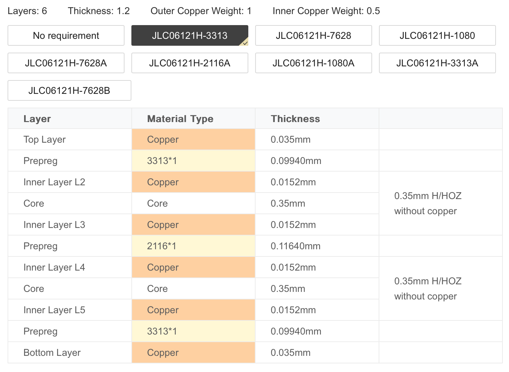

Routing
=======

Stackup
-------

The stackup used is JLCPCB's JLC06121H-3313 1.2mm pcb stackup.

.. flat-table:: Layer allocation
   :header-rows: 1
   :width: 100%

   * - Layer
     - Allocation

   * - Top layer
     - High-Speed signals

   * - Inner Layer L2
     - GND

   * - Inner Layer L3
     - Power

   * - Inner Layer L4
     - Low-Speed signals

   * - Inner Layer L5
     - GND

   * - Bottom layer
     - High-Speed signals

Net classes
-----------

.. note:: Controlled impedance traces shall be routed on outer layers.

.. flat-table:: Net classes
   :header-rows: 1
   :width: 100%

   * - Type
     - Trace width
     - Trace spacing
     - Differencial-pair spacing

   * - 50ohm impedance classes
     - 6.16mil
     - 3*6.16mil
     - 

   * - 100ohm impedance classes
     - 4.88mil
     - 3*4.88mil
     - 8.0mil

Length matching
---------------

SRAM
^^^^

SDRAM
^^^^^

DDR2
^^^^

EMMC
^^^^

.. flat-table:: Signal trace length skew constraints
   :header-rows: 1
   :width: 100%

   * - Constraint
     - Description

   * - LC1
     - Mismatch within DAT0~DAT7+DS <= 6.35mm

   * - LC2
     - CLK to DAT0~7+DS mismatch <= 6.35mm

   * - LC3
     - CLK to CMD mismatch <= 6.35mm

   * - LC4
     - CLK to RST_N mismatch <= 25.4mm

.. note:: Signals applicable to LC1 will be matched to the longest one of them

.. flat-table:: Length matching implementation
   :header-rows: 1
   :width: 100%

   * - Signal
     - Pre-matching length
     - LC1
     - LC2
     - LC3
     - LC4
     - Matching target  
     - Post-matching length

   * - CLK
     - 20.3272mm
     - N/A
     - N/A
     - N/A
     - N/A
     - N/A
     - N/A

   * - CMD
     - 6.3060mm + 14.0359mm = 20.3419mm
     - N/A
     - N/A
     - Yes
     - N/A
     - N/A
     - N/A

   * - RST_N
     - 5.5110mm + 12.2321mm = 17.7431mm
     - N/A
     - N/A
     - N/A
     - Yes
     - N/A
     - N/A

   * - DS
     - 6.8913mm + 11.8773mm = 18.7686
     - Yes
     - Yes
     - N/A
     - N/A
     - N/A
     - N/A

   * - DAT0
     - 11.9839mm
     - No
     - No
     - N/A
     - N/A
     - 17.1522mm
     - 17.1092mm

   * - DAT1
     - 13.8076mm
     - No
     - No
     - N/A
     - N/A
     - 17.1522mm
     - 17.1522mm

   * - DAT2
     - 13.6520mm
     - No
     - No
     - N/A
     - N/A
     - 17.1522mm
     - 17.1522mm

   * - DAT3
     - 14.1856mm
     - No
     - No
     - N/A
     - N/A
     - 17.1522mm
     - 17.0792mm

   * - DAT4
     - 13.2395mm
     - No
     - No
     - N/A
     - N/A
     - 17.1522mm
     - 17.0578mm

   * - DAT5
     - 7.7123mm + 11.7709mm = 21.8832mm
     - Longest
     - Yes
     - N/A
     - N/A
     - N/A
     - N/A 

   * - DAT6
     - 7.2509mm + 12.8758mm = 20.1268mm
     - Yes
     - Yes
     - N/A
     - N/A
     - N/A
     - N/A

   * - DAT7
     - 15.6162mm
     - No
     - No
     - N/A
     - N/A
     - 17.1522mm
     - 17.1522mm

.. note:: The length target is the CLK trace length minus half of the tolerance. This is done to leave a margin for any delays within the emmc package itself.

.. note:: Vias are added to signals routed on the top layer to have an equal number of vias for all signals, to ease length matching.
