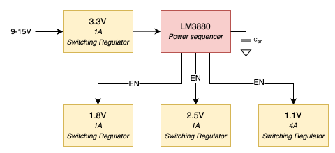
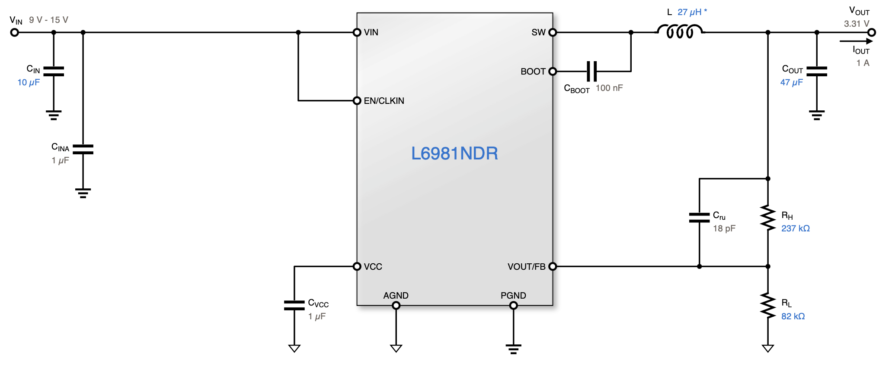
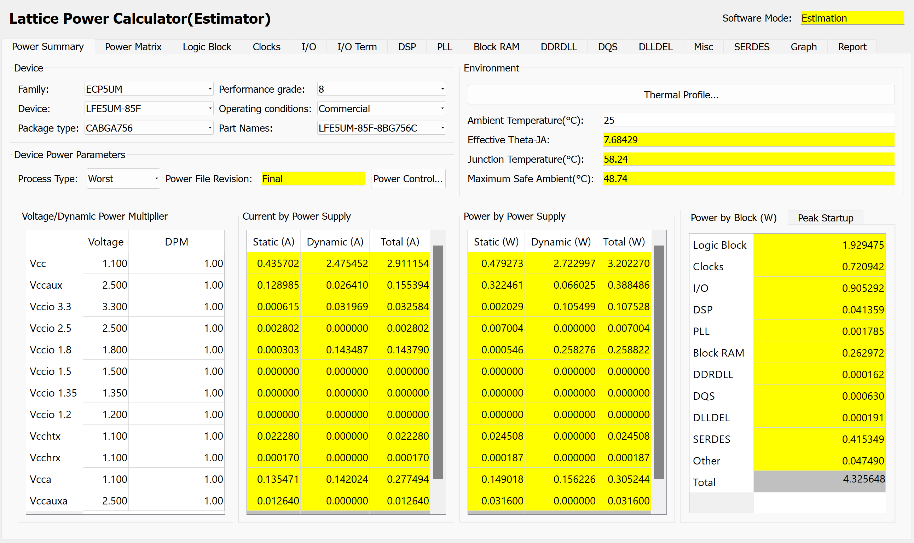

(F1) Power
==========

Functional description
----------------------

The power sub-circuit is in charge of converting the supply voltage from the IO connector to the following supply voltages required for the board's operation :

.. flat-table:: Supply Voltage Requirements
   :header-rows: 1
   :width: 100%

   * - Voltage
     - Current capacity

   * - 1.1V ±5%
     - 3.5A
   * - 2.5V ±5%
     - 500mA
   * - 3.3V ±5%
     - 1A
   * - 1.8V ±5%
     - 500mA

The sub-circuit enables the voltage regulators in the following sequence, with a 10ms delay:



|

.. note:: The 3.3V voltage regulator is enabled by default so it can power the power sequencing IC.

Design constraints
------------------

N/A


Circuit diagram
---------------

1.1V regulator
``````````````


.. image:: ../assets/buck-1V1.png
   :width: 70%
   :align: center

Refer to the following document for full details : `buck-1.1-report.pdf <../_static/buck-1.1-report.pdf>`_.

1.8V regulator
``````````````

.. image:: ../assets/buck-1V8.png
   :width: 70%
   :align: center

Refer to the following document for full details : `buck-1.8-report.pdf <../_static/buck-1.8-report.pdf>`_.

2.5V regulator
``````````````

.. image:: ../assets/buck-2V5.png
   :width: 70%
   :align: center

Refer to the following document for full details : `buck-2.5-report.pdf <../_static/buck-2.5-report.pdf>`_.

3.3V regulator
``````````````



Refer to the following document for full details : `buck-3.3-report.pdf <../_static/buck-3.3-report.pdf>`_.

Power sequencing
````````````````


.. flat-table:: Power sequencer IC
   :stub-columns: 1
   :width: 100%

   * - IC
     - LM3880
   * - Sequence Number
     - 1 (1-2-3 / 3-2-1)
   * - Timing Designator
     - AA (10ms)
   * - Ordering reference
     - LM3880MF*-1AA

Design calculations
-------------------

Supply requirements
```````````````````

In order to perform a rough FPGA power estimation, the following assumptions were taken :

- LFE5U-85F-8BG756C reference
- 200MHz internal frequency
- 25% Activity Factor (as stated in :ref:`AN1 <reftable>`)
- 70% logic utilization
- 100% BRAM utilization
- 64 LVDS input differential pairs
- eMMC IOs
- SRAM Address/Data IOs
- SDRAM Address/DQ IOs
- DDR2 Address/DQ IOs

.. note:: I/O utilization isn't precisely modelled as the IO power consumption is low. Margins will be taken to prevent any supply issues.



|

The following table outlines the voltage requirements of the specified components :

.. flat-table:: Component Supply Voltage Requirements
   :header-rows: 1
   :width: 100%

   * - Component
     - Name
     - Voltage
     - Max Current
     - Description
   
   * - :rspan:`3` LFE5U-85F-*BG756C
     - VCC
     - 1.1V ±5%
     - 3A
     - Core Supply Voltage
   * - VCCAUX
     - 2.5V ±5%
     - 200mA
     - Auxilary Supply Voltage
   * - VCCIO[*]
     - 
     - 
     - 
   * - VCCIO8
     - 3.3V ±10%
     - 100mA
     - sysIO bank Supply Voltage
   * - IS61W25616BLL
     - VDD
     - 3.3V ±5%
     - 50mA
     - Supply Voltage
   * - :rspan:`1` IS42S16160J
     - VDD
     - 3.3V ±10%
     - 140mA
     - Supply Voltage
   * - VDDQ
     - 3.3V ±10%
     - *included in VDD*
     - I/O Supply Voltage
   * - :rspan:`2` IS43DR16320E
     - VDD
     - 1.8V ±5%
     - 185mA
     - Supply Voltage
   * - VDDQ
     - 1.8V ±5%
     - *included in VDD*
     - I/O Supply Voltage
   * - VDDL
     - 1.8V ±5%
     - *included in VDD*
     - DLL Supply Voltage
   * - W25Q158JVPIM
     - VCC
     - 3.3V ±10%
     - 25mA
     - Supply Voltage
   * - :rspan:`1` ASFC4G31M-51BIN
     - VCCQ
     - 1.8V ±8%
     - 120mA
     - Host Interface Supply Voltage
   * - VCC
     - 3.3V ±10%
     - 120mA
     - Memory Supply Voltage

Power Sequencing
````````````````

.. flat-table:: Power-up timings
   :header-rows: 1
   :stub-columns: 2
   :width: 100%

   * - IC
     - Voltage
     - Max ramp rate
     - Max start time
   * - ST1S41PHR
     - 1.1V
     - 1.1mV/us
     - 1ms
   * - L6981NDR
     - 1.8V
     - 1.8mV/us
     - 1.6ms
   * - L6981NDR
     - 2.5V
     - 2.5mV/us
     - 1.6ms
   * - L6981NDR
     - 3.3V
     - 3.3mV/us
     - 1.6ms

The following formula is used to compute the value of :math:`C_{\text{en}}` which applies a delay to the start of the sequence:

.. math::

   t_{\text{enable_delay}} = \frac{1.25V * C_{\text{en}}}{7 \mu A}

:math:`t_{\text{enable_delay}}` must greater than the start time of the 3.3V regulation (ie. 1.6ms), therefore :

.. math::

  C_{\text{en}} = 56nF \implies t_{\text{enable_delay}} = 10ms

Simulation results
------------------

1.1V Core
`````````

Refer to the following document for full details : `buck-1.1-report.pdf <../_static/buck-1.1-report.pdf>`_.

1.8V
````

Refer to the following document for full details : `buck-1.8-report.pdf <../_static/buck-1.8-report.pdf>`_.

2.5V
````

Refer to the following document for full details : `buck-2.5-report.pdf <../_static/buck-2.5-report.pdf>`_.

3.3V
````

Refer to the following document for full details : `buck-3.3-report.pdf <../_static/buck-3.3-report.pdf>`_.

Power sequencing
````````````````

N/A
