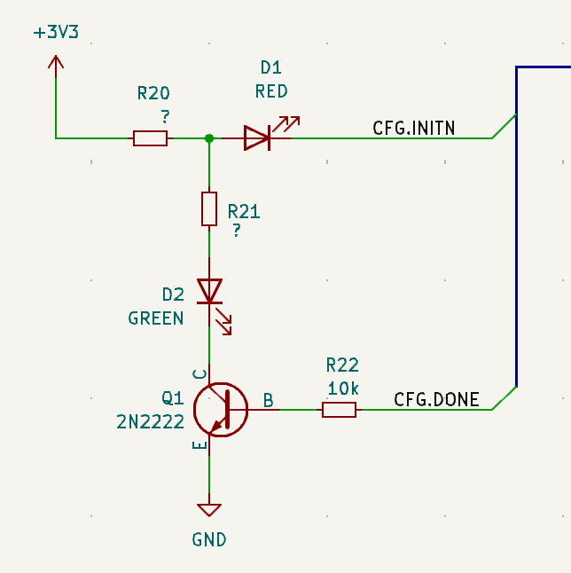

(F2) FPGA
=========

Design constraints
------------------

Operating Conditions
^^^^^^^^^^^^^^^^^^^^

.. requirement:: D_FPGA_01
   :derivedfrom: U_FPGA_01

   A power estimation for the FPGA supply voltages shall be performed.

.. requirement:: D_FPGA_02
   :rationale: This corresponds to a 5% precision around 1.1V.
   :derivedfrom: U_FPGA_01

   The VCC supply voltage shall be within 1.045V and 1.155V.

.. requirement:: D_FPGA_03
   :rationale: This corresponds to a 5% precision around 2.5V.
   :derivedfrom: U_FPGA_01

   The VCCAUX supply voltage shall be within 2.375V and 2.625V.

.. requirement:: D_FPGA_04
   :derivedfrom: U_FPGA_01

   The VCCAUX supply voltage ramp shall not exceed 30mV/us during power-up.

.. requirement:: D_FPGA_05
   :derivedfrom: U_FPGA_01

   VCCIO[0:8] supply voltages shall be between 1.14V and 3.465V.

.. note:: Specific VCCIO[0:8] supply voltages are defined in the design section based on the FPGA pinout.

.. requirement:: D_FPGA_10
   :derivedfrom: U_FPGA_01

   Power supply ramp rate for all supplies shall not exceed 10V/ms.

.. requirement:: D_FPGA_11
   :derivedfrom: U_FPGA_01

   The following power-up sequence of supply voltages shall be implemented : VCCIO*, VCCAUX, VCC.

.. note:: The current requirement for the FPGA supply voltages is not defined in the FPGA datasheet. A power estimation is performed in the design section to provide upper current bounds.

.. requirement:: D_FPGA_12
   :derivedfrom: U_FPGA_01

   The FPGA junction temperature shall not exceed 85°C.

Configuration
^^^^^^^^^^^^^

As the FPGA sysCONFIG configuration is MSPI, only requirements targetting this configuration method are outlined.

.. requirement:: D_FPGA_13
   :derivedfrom: U_FPGA_01

   4.7kohms pull-up resistors shall be placed between the following signals and VCCIO8: TDI, TMS, TDO.

.. requirement:: D_FPGA_14
   :derivedfrom: U_FPGA_01

   A 4.7kohms pull-down resistor shall be placed between TCK and GND.

.. requirement:: D_FPGA_15
   :derivedfrom: U_FPGA_01

   4.7kohms pull-up resistors shall be placed between the following signals and VCCIO8: PROGRAMN and INITN.

.. requirement:: D_FPGA_16
   :derivedfrom: U_FPGA_01

   A 10kohms pull-up resistor shall be placed between CSSPIN and VCCIO8.

.. requirement:: D_FPGA_17
   :derivedfrom: U_FPGA_01

   A 1kohms pull-up resistor shall be placed between MCLK and VCCIO8.

.. requirement:: D_FPGA_18
   :derivedfrom: U_FPGA_01

   10kohms pull-up resistors shall be placed between CFG[2:0] and VCCIO8 when the configuration bit shall be 1. CFG[2:0] shall be directly connected to GND otherwise.

Configuration
-------------

CFGMDN[2:0]
^^^^^^^^^^^

.. requirement:: D_CONF_01
   :rationale: The sysCONFIG pins are configured as Master SPI.

   The CFGMDN[2:0] pins shall be configured as 010 using 4.7k pull-up or pull-down resistors.

IO[3:0]
^^^^^^^

.. requirement:: D_CONF_02

   10k pull-up resistors shall be used on sysCONFIG IO[3:0] pins.
   
.. requirement:: D_CONF_03

   A 1k pull-up resistor shall be used on sysCONFIG CLK pin.

PROGRAMN
^^^^^^^^

.. requirement:: D_CONF_04

   A 100nF capacitor shall be placed between PROGRAMN and GND.

INITN and DONE
^^^^^^^^^^^^^^

INITN is open-drain.

FPGA Pinout
-----------

The following table outlines the FPGA interface signals and their pinout constraints.

.. note:: The I/O column is from the FPGA's perspective to ease the creation of design constraints files.

.. csv-table:: Oscillator interface signals
   :header-rows: 1
   :width: 100%
   :file: ../assets/osc-pinout.csv
   :delim: ;

.. csv-table:: Flash interface signals
   :header-rows: 1
   :width: 100%
   :file: ../assets/flash-pinout.csv
   :delim: ;

.. csv-table:: eMMC interface signals
   :header-rows: 1
   :width: 100%
   :file: ../assets/emmc-pinout.csv
   :delim: ;

.. csv-table:: SRAM interface signals
   :header-rows: 1
   :width: 100%
   :file: ../assets/sram-pinout.csv
   :delim: ;

.. csv-table:: SDRAM interface signals
   :header-rows: 1
   :width: 100%
   :file: ../assets/sdram-pinout.csv
   :delim: ;

.. csv-table:: DDR2 interface signals
   :header-rows: 1
   :width: 100%
   :file: ../assets/ddr2-pinout.csv
   :delim: ;

.. csv-table:: IO connector interface signals
   :header-rows: 1
   :width: 100%
   :file: ../assets/io-pinout.csv
   :delim: ;
