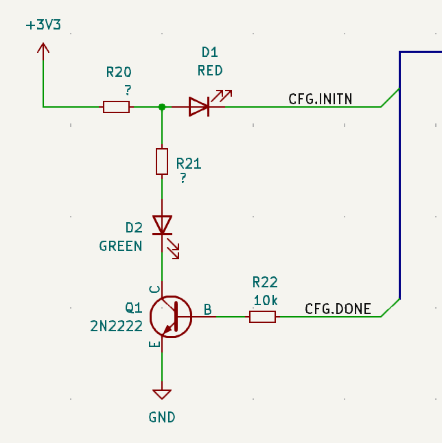

F2. FPGA
=======

Configuration
-------------

CFGMDN[2:0]
^^^^^^^^^^^

.. requirement:: D_CONF_01
   :rationale: The sysCONFIG pins are configured as Master SPI.

   The CFGMDN[2:0] pins shall be configured as 010 using 4.7k pull-up or pull-down resistors.

IO[3:0]
^^^^^^^

.. requirement:: D_CONF_02

   10k pull-up resistors shall be used on sysCONFIG IO[3:0] pins.
   
.. requirement:: D_CONF_03

   A 1k pull-up resistor shall be used on sysCONFIG CLK pin.

PROGRAMN
^^^^^^^^

.. requirement:: D_CONF_04

   A 100nF capacitor shall be placed between PROGRAMN and GND.

INITN and DONE
^^^^^^^^^^^^^^

INITN is open-drain.

FPGA Pinout
-----------

The following table outlines the FPGA interface signals and their pinout constraints.

.. note:: The I/O column is from the FPGA's perspective to ease the creation of design constraints files.

.. csv-table:: Oscillator interface signals
   :header-rows: 1
   :width: 100%
   :file: ../assets/osc-pinout.csv
   :delim: ;

.. csv-table:: Flash interface signals
   :header-rows: 1
   :width: 100%
   :file: ../assets/flash-pinout.csv
   :delim: ;

.. csv-table:: eMMC interface signals
   :header-rows: 1
   :width: 100%
   :file: ../assets/emmc-pinout.csv
   :delim: ;

.. csv-table:: SRAM interface signals
   :header-rows: 1
   :width: 100%
   :file: ../assets/sram-pinout.csv
   :delim: ;

.. csv-table:: SDRAM interface signals
   :header-rows: 1
   :width: 100%
   :file: ../assets/sdram-pinout.csv
   :delim: ;

.. csv-table:: DDR2 interface signals
   :header-rows: 1
   :width: 100%
   :file: ../assets/ddr2-pinout.csv
   :delim: ;

.. csv-table:: IO connector interface signals
   :header-rows: 1
   :width: 100%
   :file: ../assets/io-pinout.csv
   :delim: ;
